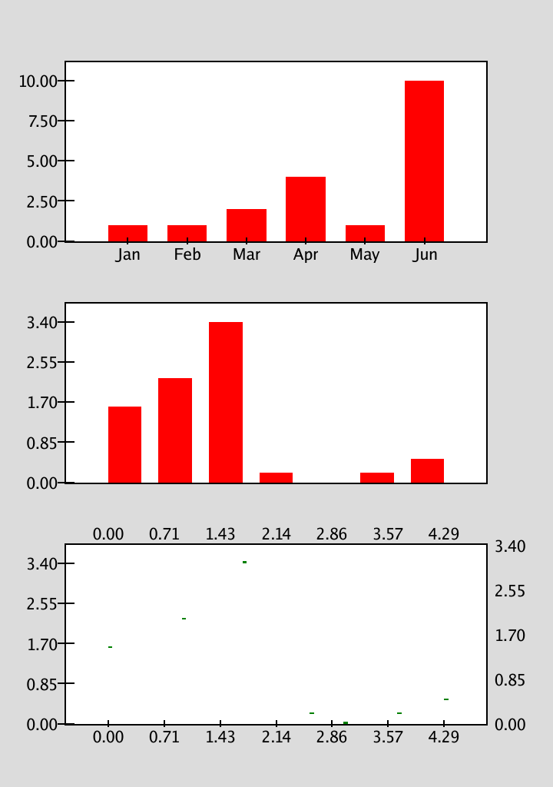

# Data Plotter in Go
I am designing a data plotter with only Go dependencies to learn and study about Go.
The current state of this package in not ready for usage. You may use it at your own discretion.

## Testing the code
To test the code, run:
`go run example/png/main.go`

or build:
`go build example/png/main.go`

This will generate an `out.png` file.
Then, the default image viewer will open `out.png`.

## Usage
Import this package as:
```go
import "github.com/cgxeiji/plt"
```

Extra features under:
```go
import "github.com/cgxeiji/plt/canvas"
```

### Basic Bar Chart

```go
// Load some values
x := []string{"Jan", "Feb", "Mar", "Apr", "May", "Jun"}
y := []float64{1, 1, 2, 4, 1, 10}

// Create default Bar Chart and return plot (draw.Image)
plot, err := plt.Bar(x, y)
if err != nil {
	log.Panic(err)
}

// Export with your favourite encoder
png.Encode(w, plot)
```

### Multiple Charts

```go
// Load some values
x := []string{"Jan", "Feb", "Mar", "Apr", "May", "Jun"}
y := []float64{1, 1, 2, 4, 1, 10}

// Create a Figure struct to start plotting
fig, err := plt.Figure(1080, 1920)
if err != nil {
	log.Panic(err)
}

// Create a 3x1 plot
axes, err := fig.SubAxes(3, 1)
if err != nil {
	log.Panic(err)
}

// Access top most plot and make a Bar Chart
axes[0].BarPlot(x, y)

// Load some more values
sx := []float64{0.0, 1.1, 2.0, 3.0, 3.5, 4.3, 5.0}
sy := []float64{1.6, 2.2, 3.4, 0.2, 0.0, 0.2, 0.5}

// Access middle plot and make a Bar Chart with no labels
axes[1].BarPlot(nil, sy)

// Access bottom plot and make a Scatter Chart
axes[2].ScatterPlot(sx, sy)

// Render Figure into plot (draw.Image)
plot := plt.Render(fig)

// Export with your favourite encoder
png.Encode(w, plot)
```

## Example Chart

